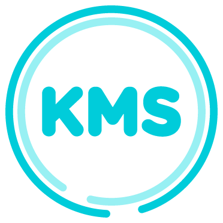

> :warning: Éste repositorio está **muerto**, y permanecerá aquí sin modificaciones sólo con propósito histórico.

  

La idea básica de KMS es tener una pulsera con una serie de sensores y que esta se comunique con nuestro smartphone
para enviar datos sobre distancia recorrida, calorías quemadas, horas de sueño, así como demás estadísticas para
mantener un control y una cuantificación de nuestras actividades físicas.

~ [Rodrigo Garrido (Xataka)](https://www.xataka.com.mx/accesorios/kms-en-mexico-tambien-se-prepara-una-pulsera-cuantificadora)

# KMS Cloud
El _kernel_ de KMS, la "nube". Diseñado para ejecutarse en Azure Websites, éste proyecto contiene la BD, el ORM,
gestionaba la Internacionalización (en el mundo Microsoft se conocía como Globalización), el API REST y el Dashboard.

### API
El API de KMS estaba diseñado para utilizar **OAuth1.0a** (en aquél entonces utilizado principalmente por Twitter) para
la autenticación y verificación de los datos recibidos. El API generaba automáticamente la documentación a partir
de los comentarios del código C#.

Siguiendo con mi obsesión de _future-proofing_, el API permitía a terceros solicitarnos un API Key para obtener
datos de nuestros usuarios mediante el flujo que ahora es muy común ver para Login con Facebook, Github, Google, etc.

### Certificates
Cometí el error de novato de subir los certificados que permitían hacer una variedad de cosas en la _nube_ de KMS
a nuestro repositorio privado. **NO LO HAGAS**.

### Database
La base de datos, naturalmente, está diseñada para montarse en SQL Server. El ORM permitía realizar queries mediante
Linq, que a su vez volvía las consultas "strongly-typed" y permitía hacer cosas increíbles como hacer queries sobre
estructuras de datos en memoria como si fuera SQL. Me parece que Linq aún existe, y es fenomenal.

### Globalization
Aunque el proyecto se llamó KMS, en alusión a Kilómetros, por mi obsesión por ser lo más _future-proof_ posible,
podrías ser un usuario en Estados Unidos y visualizar tus kilómetros **en millas**.  Integré una Globalización a un
nivel de conversión de unidades de medida, peso y distancia, fecha y hora además de soporte para agregar nuevos
idiomas, **inclusive en BD**, que muy probablemente no vea de nuevo en ningún otro proyecto en un buen rato.
**Lamentablemente i18n nunca es prioridad**.

### WebApp
El _Dashboard_ de KMS permitía a los usuarios visualizar sus kilómetros, ver sus logros, recompensas, conectar
con amigos y demás. Lamentablemente no sobrevivimos lo suficiente para terminar con la implementación del sistema
de amigos.
